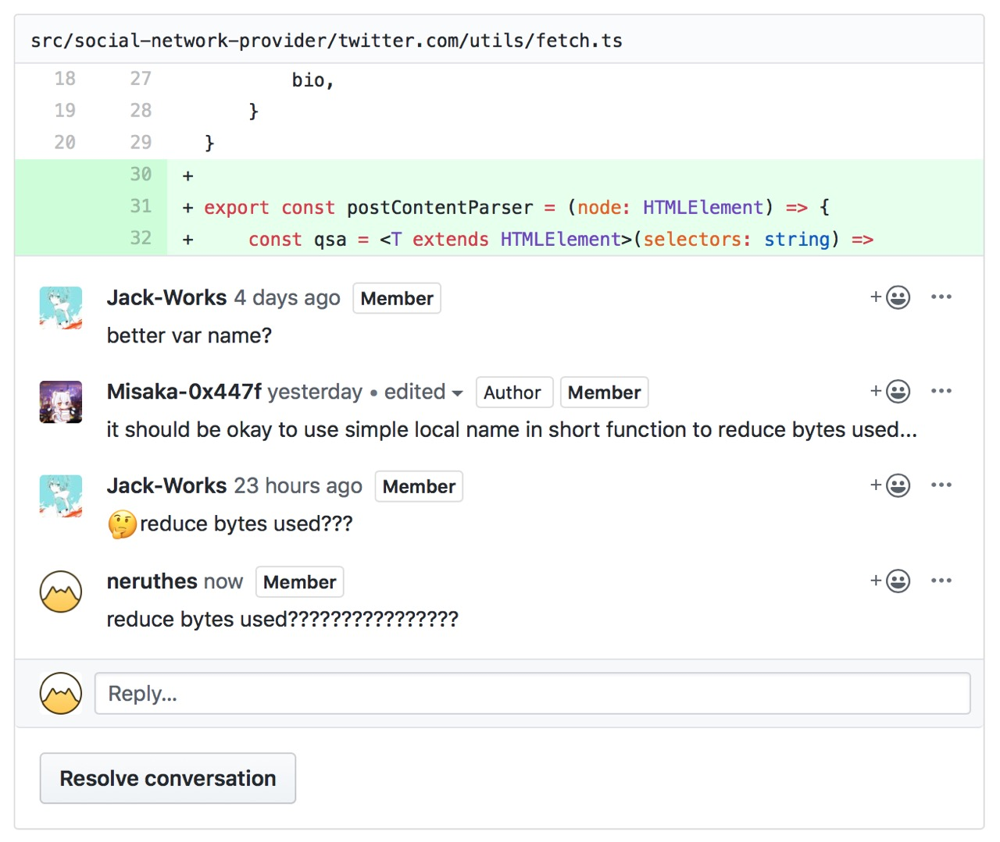
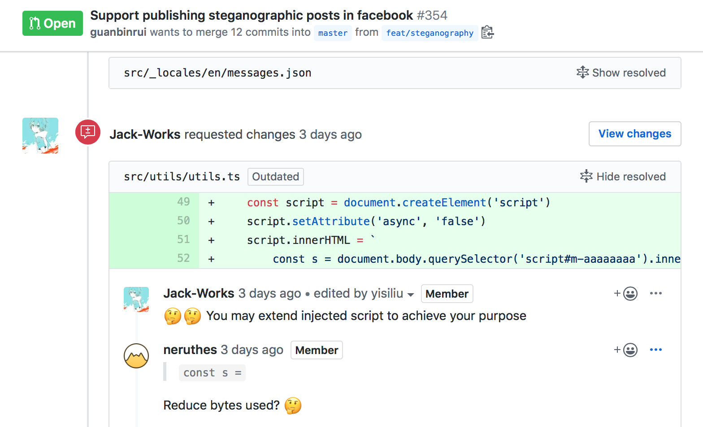
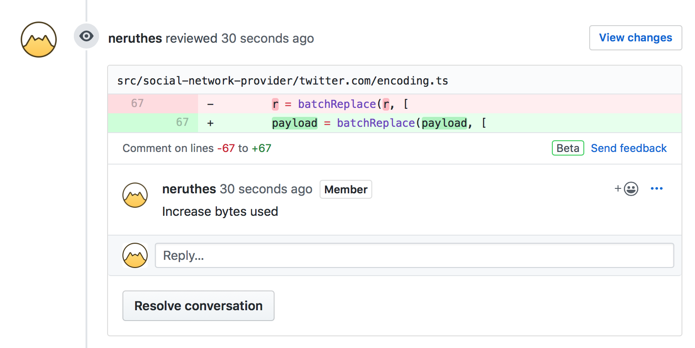

# Reduce-Bytes-Used

src | href
--- | ---
 | [link](https://github.com/DimensionDev/Maskbook/pull/228#discussion_r338028481)
 | [link](https://github.com/DimensionDev/Maskbook/pull/354#discussion_r344550758)
 | [link](https://github.com/DimensionDev/Maskbook/issues/329)
 | [link](https://github.com/DimensionDev/Maskbook/pull/430#discussion_r351128809)
 | [link](https://github.com/DimensionDev/Maskbook/commit/61ee1e99d75319703b33ac1d926fa1fb58215e27)
 | [link](https://github.com/DimensionDev/Maskbook/pull/719)
 | [link](https://github.com/DimensionDev/Maskbook/pull/856#discussion_r389453982)
